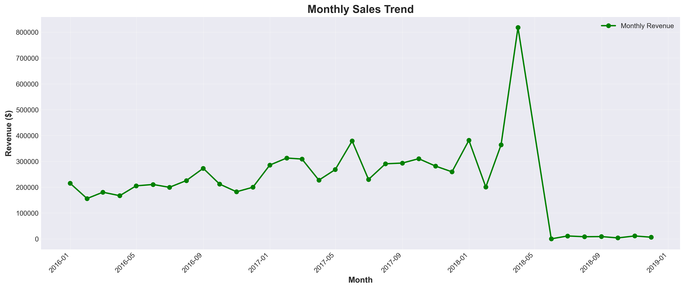
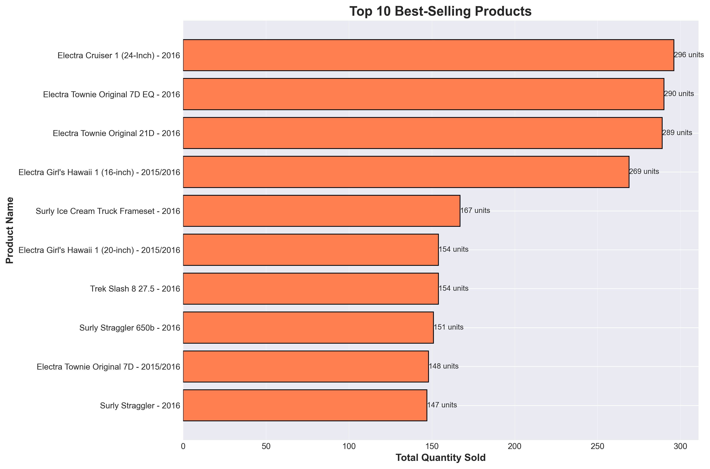

# BIKEWAY Analytics
# About us
**BIKEWAY** is a growing bike retail company operating multiple stores across different cities. We specialize in selling bikes, cycling accessories, and related products from various popular brands.\
\
As a data analyst at BIKEWAY, I work with our sales, inventory, and customer data to help the business make informed decisions. Our analytics focus on: 
- **Sales Performance**: Tracking revenue across different stores and time
- **Product Analytics**: Identifying best-selling products and popular brands
- **Customer Insights**: Analysing customer buying patterns and loyalty
- **Inventory Management**: Monitoring stock levels for prevention of shortages
- **Staff Performance**: Analyzing our team's efficiency 

# Main Analytics



# Installation
## Prerequisites
- PostgreSQL (version 12 or higher)
- Python 3.8+
## Tool installation
1. Download PostgreSQL from https://www.postgresql.org/download/windows/ 
   - run installer, set password for postgres user (remember it)
   - keep default port 5432
2. Download Python from https://www.python.org/downloads/
   -get latest 3.x version
   -run installer
   -check "Add Python to PATH"
3.
  - pip install mysql-connector-python
  - pip install psycopg2-binary
  - pip install apache-superset

## Database Connection
cmd:
```cmd
cd C:\path\to\your\folder
pip install psycopg2-binary
python main.py
```

# Tools and Resources
Bike Store Relational Database by Dillon Myrick \
PostgreSQL - Relational database management system \
SQL - Query language for data analysis \
Python - Data manipulation and automation \
Apache Superset - Data visualization platform \
VS Code - Code editor 
